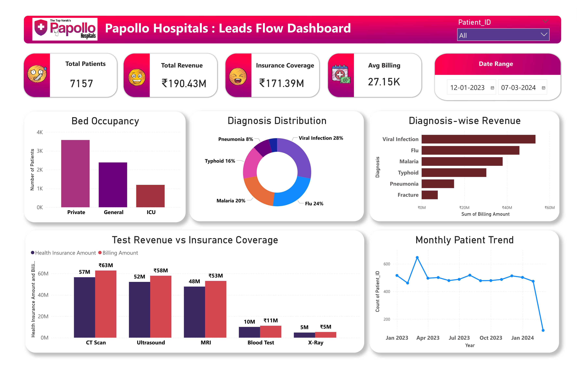

# Hospital Analytics Dashboard (Power BI)

## Project Overview

This project presents an interactive Power BI dashboard built to analyze hospital operational and financial data. The dashboard helps identify patient trends, diagnosis distribution, revenue generation, and resource utilization in a healthcare environment.

## Tools Used

* Power BI
* Microsoft Excel
* Data Visualization

## Key Metrics

* Total Patients
* Total Revenue
* Insurance Coverage
* Average Billing per Patient

## Dashboard Insights

* Viral infections account for the highest percentage of patient diagnoses.
* Flu and malaria are also major contributors to hospital admissions.
* Private beds show the highest occupancy among all bed categories.
* CT scans and ultrasounds generate the highest revenue among diagnostic tests.
* Insurance coverage contributes significantly to hospital revenue.
* Monthly patient trends show fluctuations in hospital demand across different months.

## Visualizations Used

* Bed Occupancy Analysis
* Diagnosis Distribution
* Diagnosis-wise Revenue
* Test Revenue vs Insurance Coverage
* Monthly Patient Trend

## Project Files

* PBIX file – Power BI dashboard file
* Dashboard preview image
* PDF dashboard export
* Project report

## Dashboard Preview

